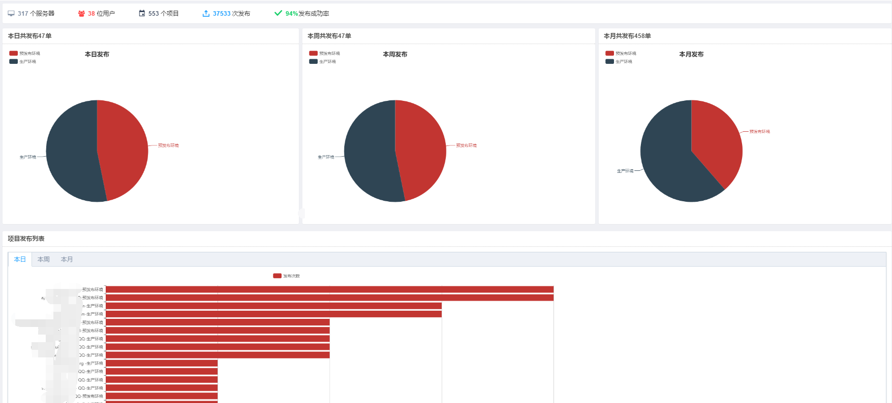
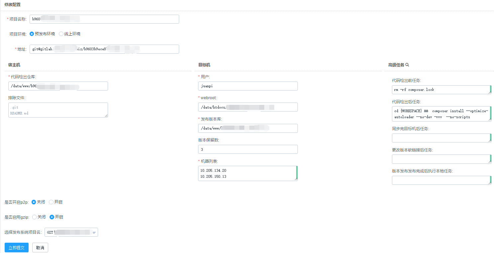
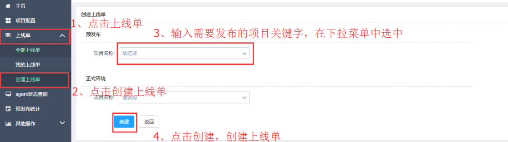
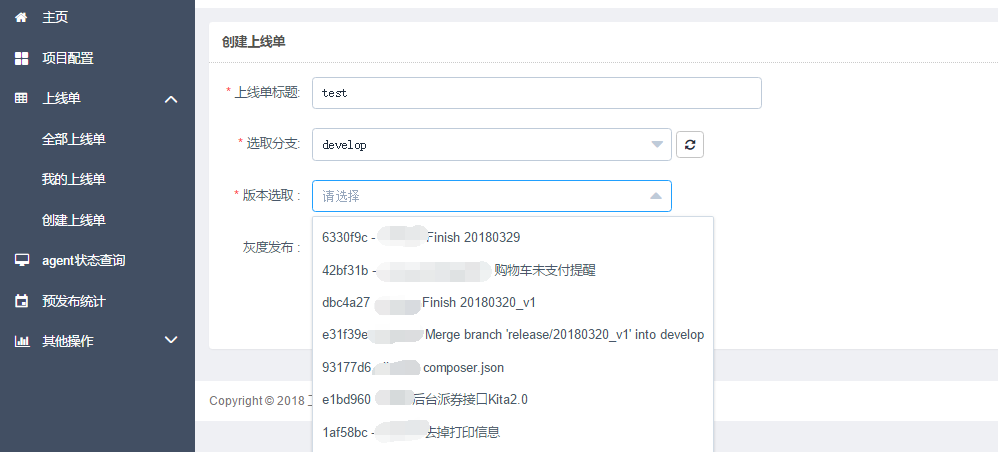
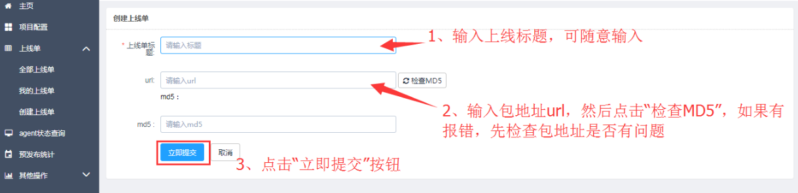
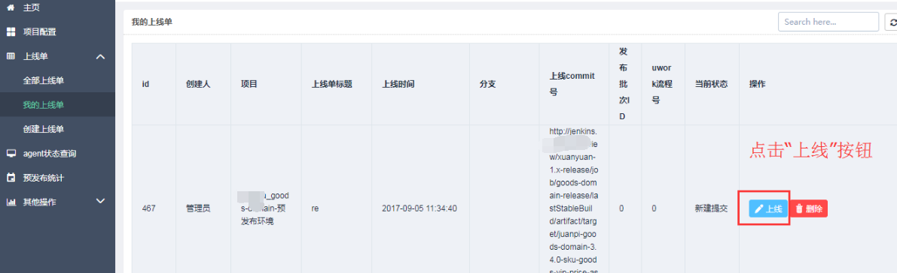
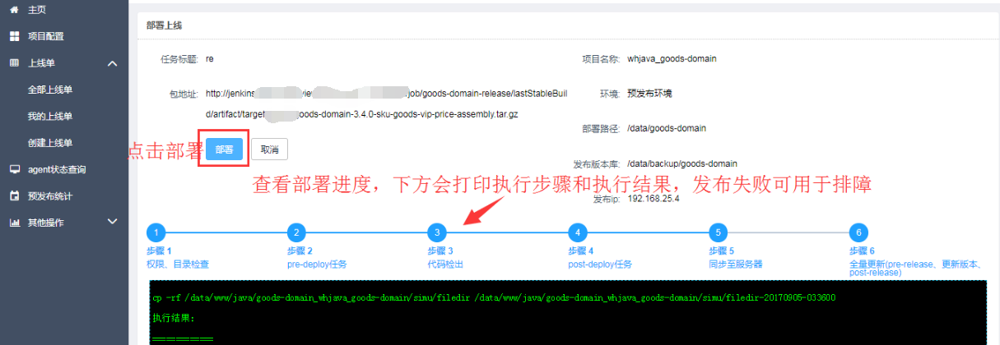

gopub（基于vue.js element框架+golang beego框架开发）是一个基于运维场景设计的企业级运维发布系统。配置简单、功能完善、界面流畅、开箱即用！支持git、jenkins版本管理，支持各种web代码发布，一键完成Golang,nodejs,PHP，Python，JAVA等代码的发布、回滚操作。

我们运维团队前期使用walle(https://www.walle-web.io) web部署系统进行发布操作,在此也感谢walle团队贡献的优秀开源项目.walle的web体验比较好,本次开源的gopub前台完全模仿walle前台,使用vue.js element框架重写.

gopub已在我们预发布和生产环境完成37000+次稳定部署,支持单项目100+台服务器部署110秒左右,支持2G+CDN静态资源发布传输30秒完成.

## 使用框架
* [Element](http://element-cn.eleme.io/#/zh-CN)
* [Beego](https://beego.me/)
* [httprouter](https://github.com/julienschmidt/httprouter) 
* [Taipei-Torrent](https://github.com/jackpal/Taipei-Torrent) 

## 功能特性
* 部署简便：go二进制部署,无需安装运行环境,下个版本将支持Docker部署
* gitlab发布支持：配置每个项目git地址,自动获取分支,commit选择并自动拉取代码
* jenkins发布支持：支持jenkins编译包一键发布
* ssh执行命令/传输文件：使用golang内置ssh库高效执行命令/传输文件
* BT支持：大文件和大批量机器文件传输使用BT协议支持
* 多项目部署:支持多项目多任务并行,内置[grpool协程池](https://github.com/linclin/grpool)支持并发操作命令和传输文件
* 全web化操作：web配置项目,一键发布,一键快速回滚
* API支持：提供所有配置和发布操作API,便于对接其他系统  [API使用example](api_example/example.go)
* 部署钩子：支持部署前准备任务,代码检出后处理任务,同步后更新软链前置任务,发布完毕后收尾任务4种钩子函数脚本执行

## 源码编译安装
### 编译环境
- golang >= 1.8+ 
- nodejs >= 4.0.0（编译过程中需要可以连公网下载依赖包）

### 源码下载

``` shell
 
```


## Getting started
### 1. 项目配置


项目名称：xxx.example.com   （项目命名一定要规范并唯一）

项目环境：现在只用到预发布环境和线上环境。

地址：支持gitlab,jenkins,file三种发布方式.

 选用Git在地址栏里面填入git地址，https方式需在地址中加入账号密码,ssh方式需保证gopub所在服务器有代码拉取权限.我们一般在gitlab创建一个public用户,将gopub所在服务器key加入public用户deploy-keys设置,并将public用户授权可拉取所有gitlab项目.

 选用jenkins需要录入jenkins对于的job地址和账号密码,


#### 宿主机
代码检出库：/data/www/xxx (名称需要唯一)
排除文件：默认不填写,可填写.git(tar打包忽略.git目录)等其他需要打包忽略文件

#### 目标机器
用户：www  (目标机执行操作用户)
webroot：/data/htdocs/shell_php7 (目标机代码发布目录,软链目录)
发布版本库：/data/htdocs/backup/shell_php7 (目标机代码备份目录,实体目录,webroot软链到该目录下的对应发布目录)
版本保留数：20 (发布版本库中保留多少个发布历史)
机器列表：一行一个IP  （复制粘贴ip的时候注意特殊字符）

#### 高级任务
前面两个任务的执行是在管理机上，后面两个任务的执行是在目标机器上

代码检出前任务：视情况而定（默认为空）

代码检出后任务： 需要composer的项目需要添加：cd {WORKSPACE} && rm -rf composer.lock vendor && composer install --optimize-autoloader --no-dev -vvv --ignore-platform-reqs ，否则为空

同步完目标机后任务：视情况而定（默认为空）

更改版本软链后任务：视情况而定（默认为空）

### 2. 创建上线单




### 3. 部署操作 




## 开发团队
* [LC](https://github.com/linclin)
* pandagaoyue
* Jyang0095
* AlexKTD_
* Inner_peace_me
 
## 下个版本计划
* 支持选择蓝鲸CMDB3.0业务模块发布,避免维护IP列表
* 现有的Docker镜像基于centos打包,镜像超过1.4G,下个版本使用alpine作为基础镜像 